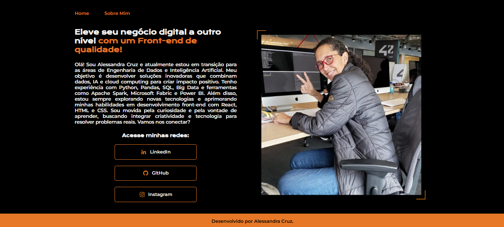
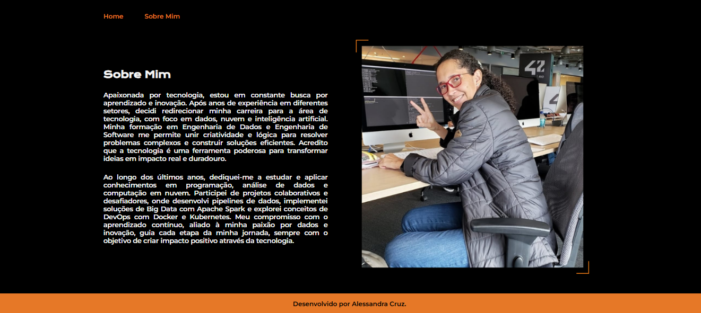

# Portfólio Pessoal 🌐

Bem-vindo(a) ao meu portfólio! Este repositório reúne projetos que desenvolvi para aprimorar minhas habilidades em HTML, CSS e JavaScript. Aqui você encontrará trabalhos que refletem meu aprendizado em front-end e minha paixão por criar interfaces dinâmicas e responsivas.

## 📂 Projetos Incluídos

### 1. **Página Sobre Mim**
Uma página de apresentação profissional destacando minha transição de carreira, habilidades técnicas e redes sociais.  
- **Tecnologias usadas:** HTML, CSS e Flexbox.
- **Funcionalidades:** Texto justificado, layout responsivo e links para redes sociais.

### 2. **Lean e Roaming**
Projetos focados em conceitos aprendidos durante a formação, como responsividade com `@media`, uso de unidades adaptáveis e Flexbox.

### 3. **Amigo Secreto**
Uma aplicação interativa que permite criar uma lista de amigos e realizar um sorteio aleatório.  
- **Tecnologias usadas:** HTML, CSS e JavaScript.

## 🛠️ Tecnologias Utilizadas
- **HTML5:** Estrutura das páginas.
- **CSS3:** Estilização, layout responsivo e Flexbox.
- **JavaScript:** Interatividade e lógica de aplicações.

## 📈 Aprendizados
Neste portfólio, apliquei conceitos importantes como:
- Desenvolvimento de layouts responsivos.
- Uso de Flexbox e media queries para adaptar o design a diferentes dispositivos.
- Criação de funcionalidades interativas com JavaScript.

## 🔗 Acesse Minhas Redes
- [LinkedIn](https://linkedin.com/in/alessandraccruz)
- [GitHub](https://github.com/alessandracruz)
- [Instagram](https://instagram.com/alessaccruz)

---

## 📂 Imagens Finais

### 1. Página Inicial

### 2. Página Sobre Mim

---

## 🔗 Visualização

- [Portfólio](https://portfolio-rho-indol-72.vercel.app/index.html)

---

Este portfólio está em constante atualização, refletindo minha jornada de aprendizado e evolução como desenvolvedora front-end. Fique à vontade para explorar e entrar em contato!
